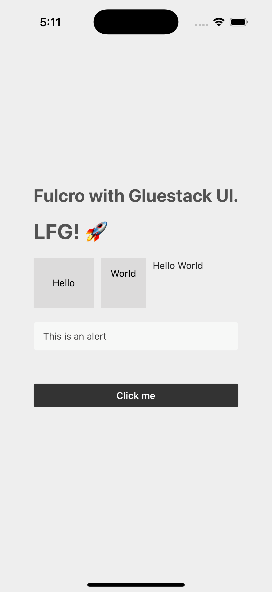

# Fulcro with Gluestack UI

This repository serves as a guide for developers who want to use [gluestack-ui](https://gluestack.io/ui/docs/home/overview/quick-start) in their Fulcro projects. The setup steps below can be applied to a new or existing React Native Fulcro project.

## Table of Contents
- [Setup Expo with Gluestack UI](#setup-expo-with-gluestack-ui)
- [Fulcro with Gluestack UI](#fulcro-with-gluestack-ui)
- [License](#license)



## Setup Expo with Gluestack UI:
I prefer to create a separate `./expo_app` directory to house all things expo and gluestack. It makes it easier to manage the project structure and dependencies.

> Note: You are not limitted to using Expo. You can use a regular React Native project setup or Next.js. For the purpose of this guide, we will use Expo.

1. Install a blank Expo app, navigate to the directory, and install Gluestack UI. Follow the Gluestack instructions:
```shell
npx create-expo-app@latest expo_app --template blank
cd expo_app
npx gluestack-ui init
```

2. Install Expo dependencies. We will install these via expo so things are properly linked:
```shell
npx expo install expo-splash-screen
npx expo install expo-status-bar
```

3. Gluestack uses Typescript so we will have to configure Expo to work with TypeScript and transpile files to CommonJS. Read more about [using TypeScript with Expo](https://docs.expo.dev/guides/typescript/).

> Hat-tip: Consider adding components/**/*.tsx and components/**/*.ts files in your `expo_app/.gitignore` file to avoid clutter. Also, add `app/` to avoid committing the shadow-cljs compiled files.

```shell
npx expo install typescript @types/react  -- --save-dev
npx expo customize tsconfig.json
```

4. Install babel-cli and add task runner scripts to `expo_app/package.json`:
```shell
npm install --save-dev @babel/cli
```
```json
{"scripts": {
  "build:js": "babel ./components -d ./components --extensions .ts,.tsx",
  "watch:js": "babel ./components -d ./components --watch --extensions .ts,.tsx"
}}
```

5. Add some Gluestack UI components and transpile them to CommonJS. For example, `npx gluestack-ui add heading` will add a heading component to your project.
```shell
npx gluestack-ui add button center text alert box hstack vstack
npm run build:js
```

6. Launch the expo app by running `npm run start` and press `i` to open the app in Simulator. You should see the default Expo App.js screen.

**Note**: For web apps, you have to update the 'web' task runner to the following:
```
"web": "DARK_MODE=class expo start --web"
```

## Fulcro with Gluestack UI:

With a working expo app, we can connect our Fulcro app to Expo and begin importing the Gluestack components. 

Shadow-cljs will be used to compile ClojureScript code to JS in the `./expo_app/app` directory. The default `./expo_app/index.js` file will be updated to import the shadow-cljs compiled code and our global CSS styles. Feel free to delete the default `./expo_app/App.js` file as we no longer need it.

```javascript
// ./expo_app/index.js

import "./app/index.js";
import "@/global.css";
```

1. Install node dependencies for Fulcro app (cd up to the root directory):
```shell
npm install --save-dev shadow-cljs
```

2. Setup dependencies and shadow-cljs. Reference the `deps.edn` and `shadow-cljs.edn` files in this repo. Take note of the `:js-options` config in shadow. It is needed to specify the package dirs so that the compiler can find the component files.
```clojure
:js-options {;; Specify the package dirs so that the compiler can find the component files
             :js-package-dirs ["expo_app/node_modules" "expo_app/components"]}
```

3. Create the Fulcro client app. We are going to use `com.fulcrologic/fulcro-native/fulcro-app` to create the client app. It handles all the necessary additional configurations needed to work with Native apps. See the `./src/main/app.example/client_native.cljs` file for full example.
```clojure
(ns
  (:require
    [com.fulcrologic.fulcro-native.expo-application :as expoapp]
    [com.fulcrologic.fulcro.application :as app]))
    
(defonce app (expoapp/fulcro-app {:client-did-mount (fn [app] (log/info "Client did mount"))
                                  :remotes {:remote (net/fulcro-http-remote 
                                                      {:url "http://localhost:3000/api"
                                                       :request-middleware (rad-app/secured-request-middleware nil)})}}))
```

4. Create a `app.example.gluestack.components.ui` namespace to house the Gluestack UI components. This is where we add wrappers around our transpiled Gluestack JS component files.
```clojure
(ns app.example.gluestack.components.ui
  (:require
    [com.fulcrologic.fulcro-native.alpha.components :refer [react-factory]]
    #?@(:cljs [["@/components/ui/gluestack-ui-provider/index.js" :refer [GluestackUIProvider]]
               ["@/components/ui/box/index.js" :refer [Box]]
               ["@/components/ui/text/index.js" :refer [Text]]])))

(def ui-provider
  #?(:cljs (react-factory GluestackUIProvider)))

(def ui-box
  #?(:cljs (react-factory Box)))

(def ui-text
  #?(:cljs (react-factory Text)))
  
...
```

5. Create a `app.example.ui.root.cljc` namespace to start testing the Gluestack UI components with the following example.
```clojure
(ns app.example.ui.root
  (:require
    [app.example.gluestack.components.ui :as gs]
    [com.fulcrologic.fulcro-native.alpha.components :as c]
    [com.fulcrologic.fulcro.components :as comp :refer [defsc]]))

(def styles (c/create-style-sheet
              {:container {:flex            1
                           :backgroundColor "#eee"
                           :alignItems      "center"
                           :justifyContent  "center"}}))

(defsc Root [_ {:ui/keys [title alert-message]}]
  {:query         [:ui/title
                   :ui/alert-message]
   :initial-state {:ui/title         "Fulcro with Gluestack UI. LFG!"
                   :ui/alert-message "This is an alert"}}
  (gs/ui-provider {:mode "light"}
    (gs/ui-box {:style (.-container styles)}
      (gs/ui-vstack {:space "2xl"}
        (gs/ui-text {:size "3xl" :bold true} title)

        (gs/ui-hstack {:space "md"}
          (gs/ui-box {:className "bg-background-200"} "Hello")
          (gs/ui-box {:className "bg-background-200"} "World")
          (gs/ui-text {:className "text-typography-900"} "Hello World"))

        (gs/ui-alert {::className "mb-8"}
          (gs/ui-alert-text {:className "bg-red-500"} alert-message))

        (gs/ui-button {:size    "md"
                       :onPress (fn [] (js/alert "Button pressed"))}
          (gs/ui-button-text {} "Click me"))))))
```

6. Tailwind needs to be aware of classnames used in our fulcro components in order to apply the correct styles. Update the content array in `./expo_app/tailwind.config.js` to include clojure files. Without this step, Tailwind will not be able to apply the correct styles to the components.
```javascript
...
content: [
    "components/**/*.{tsx,jsx,ts,js}",
    "../src/main/app/**/*.{cljc,cljs}",
],
```

7. We are now ready to run shadow-cljs and start the Expo app. Run the following commands in separate terminals:
```shell
npx shadow-cljs watch :native
```
```shell
npm run start
```

## License

This project is licensed under the MIT License. See the [LICENSE](LICENSE) file for details.

Good luck with your Fulcro and Gluestack UI project! 🚀
